# 2017_basic_exercise1
2017年度基礎知識学習　第1回授業演習用のリポジトリです。

## GitHub演習

### 1. 課題提出用リポジトリの作成
1. 講師またはTAから課題のインビテーションリンクをメールで受け取ります。
2. ブラウザのアドレスバーにインビテーションリンクを貼り付け、アクセスします。
3. 組織アカウント「yu-enpit」上にリポジトリ「課題名-アカウント名」が作成されます。
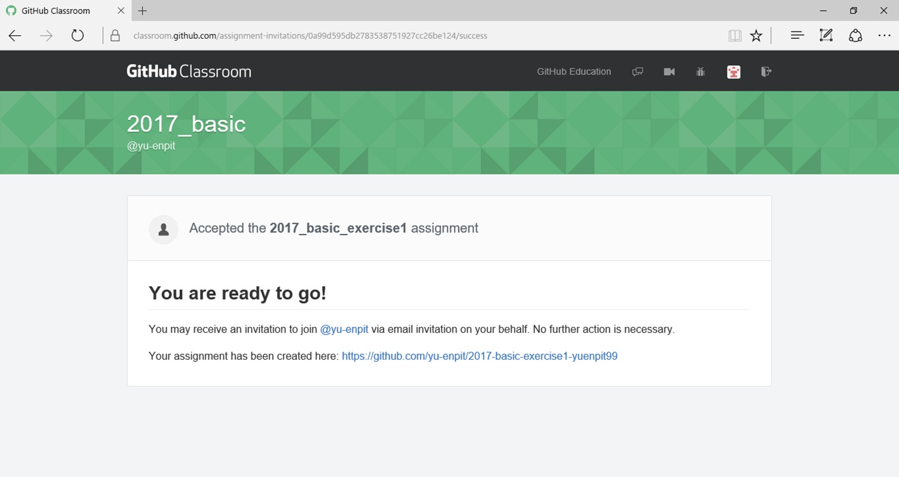

### 2. Fork（フォーク）
1. 「yu-enpit」上に作成されたリポジトリ「課題名-アカウント名」にアクセスします。
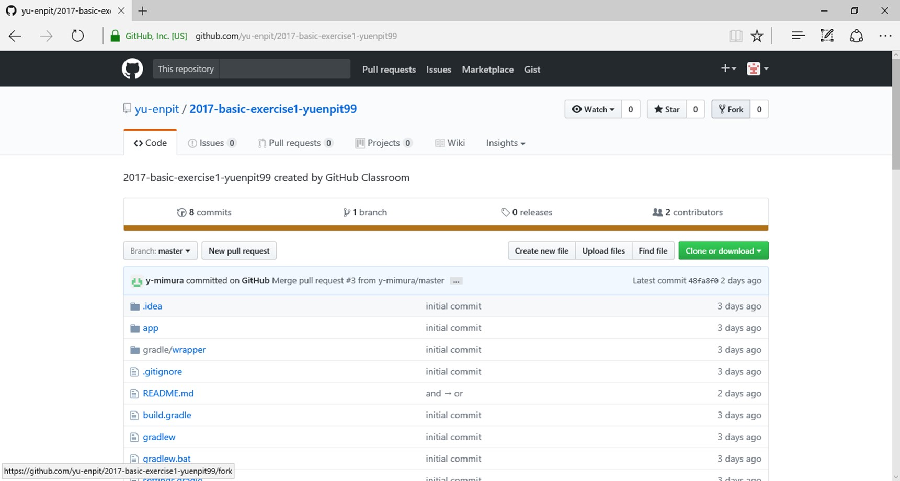
2. 右上の「Fork」ボタンをクリックします。
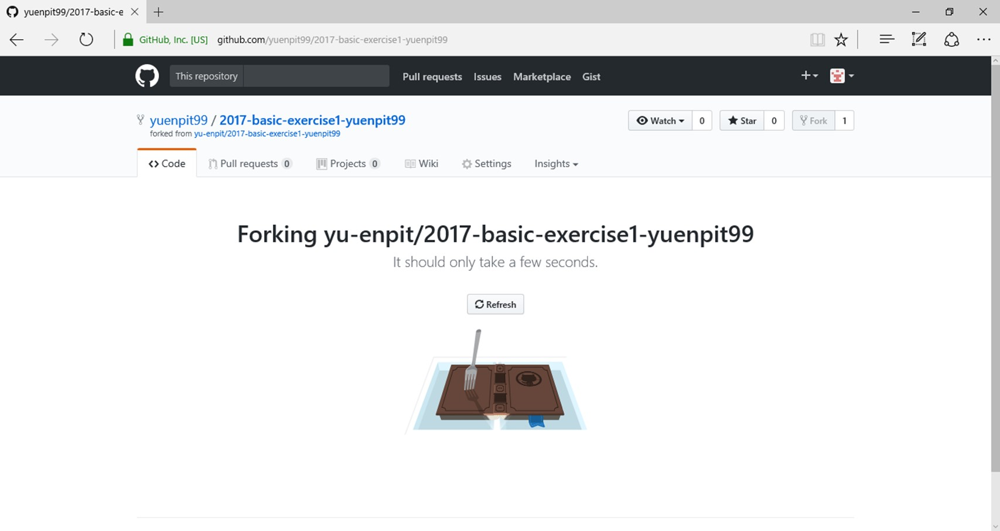
2. 自分のアカウント上に「課題名-アカウント名」のリポジトリが作成されます。
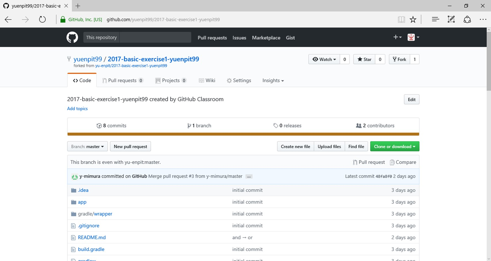

### 3. Clone（クローン）
1. 自分のアカウント上のリポジトリ「課題名-アカウント名」にアクセスします。
2. 「Clone or download」ボタンをクリックします。
3. URLをコピーします。
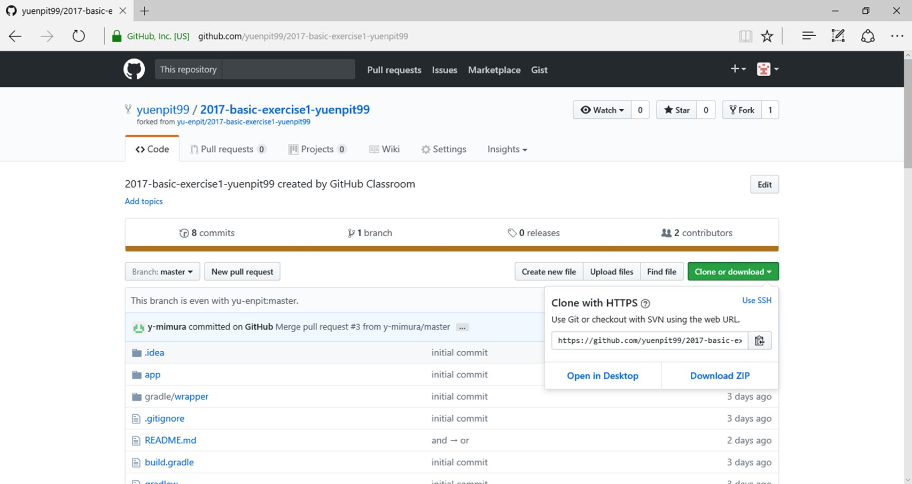
4. Git Bashを起動し、以下のコマンドを実行します。
課題名とアカウント名は適宜読み替えてください。
```
mkdir -p /c/work/yu-enpit
cd /c/work/yu-enpit
git clone https://github.com/アカウント名/課題名-アカウント名.git
```
5. 自分のアカウント上のリポジトリ「課題名-アカウント名」がローカルに保存されます。

### 4. プログラム修正
1. ローカルにクローンしたリポジトリ「課題名-アカウント名」をAndroid Studioで開きます。  
    1-1. 「Open an existing Android Studio project」を選択します。
    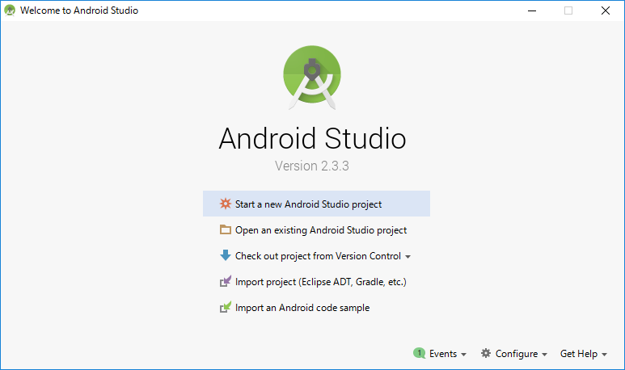  
    1-2. 先ほどローカルに保存したリポジトリを選択し、「OK」を押下します。      
2. 「activity_main.xml」を開きます。
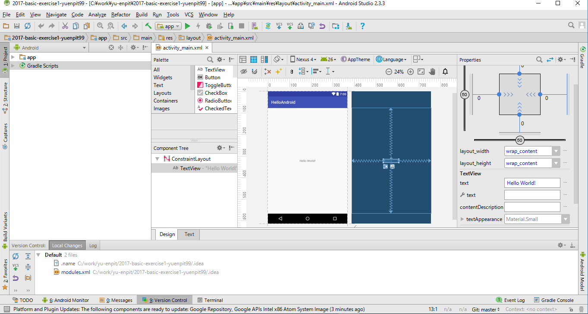
3. DesignペインでTextView「Hello World!」を選択します。
4. Propertiesペインでtextを「Hello enPiT」に修正します。
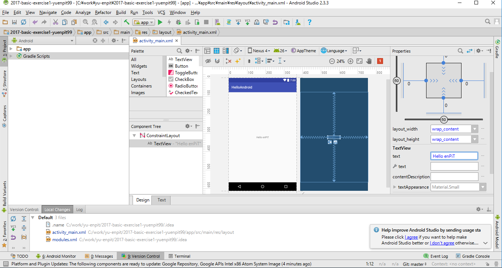

### 5. Commit（コミット）
1. ツールウィンドウ「Version Control」を表示します。
2. Defaultを右クリック > Commit Changes... をクリックします。
3. Commit Messageにコメント「TextViewのtextを修正。」を入力し、「Commit」ボタンをクリックします。
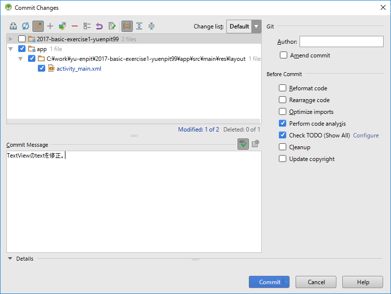

### 6. Push（プッシュ）
1. パンくずリストからプロジェクトのルートフォルダ「課題名-アカウント名」を右クリック > Git > Repository > Push をクリックします。
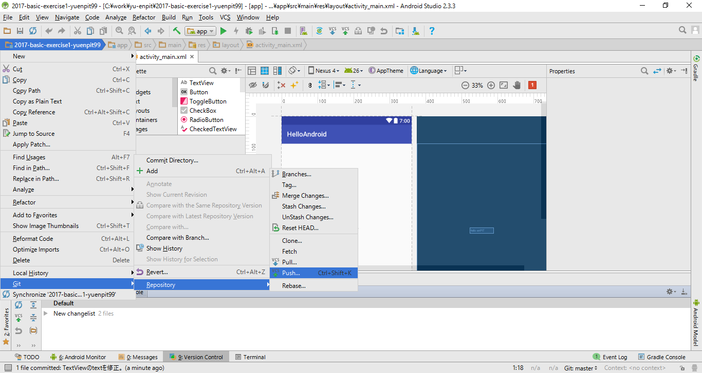
2. 「Push Commits」ウィンドウが表示されます。「Push」ボタンをクリックします。
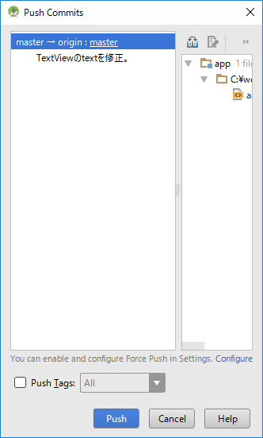
3. ローカルで行ったプログラム修正が自分のアカウント上のリポジトリ「課題名-アカウント名」に反映されます。


### 7. Pull Request（プルリクエスト）
1. 自分のアカウント上のリポジトリ「課題名-アカウント名」にブラウザからアクセスします。
2. 「New pull request」ボタンをクリックします。
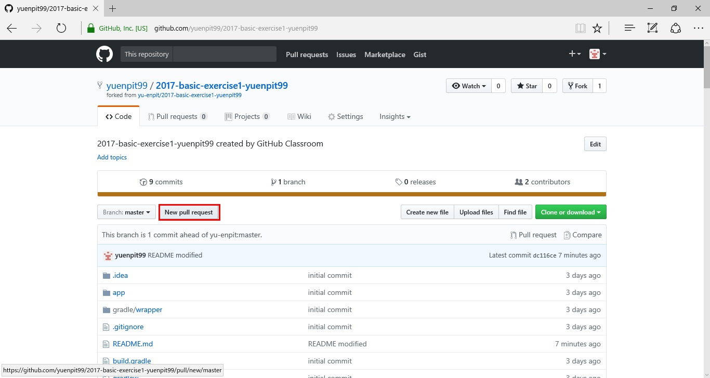
3. 「Comparing changes」画面で変更内容を確認し、「Create pull request」ボタンをクリックします。
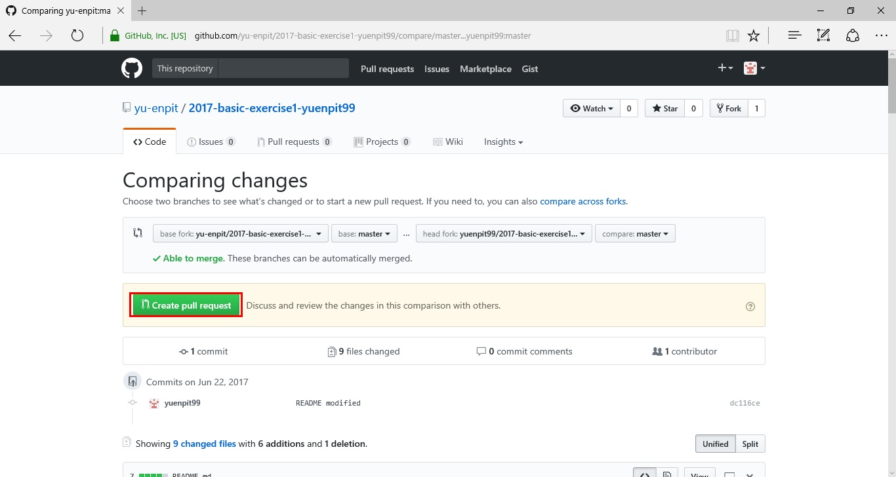
4. コメントを入力し、「Create pull request」ボタンをクリックします。
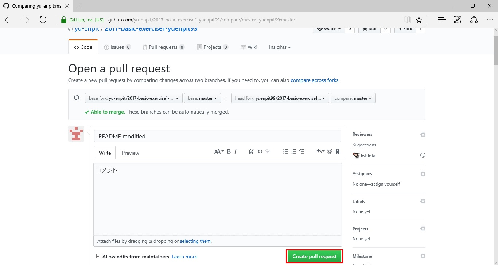
5. 組織アカウント「yu-enpit」上のFork元のリポジトリ「課題名-アカウント名」に Pull Request が送信されます。
